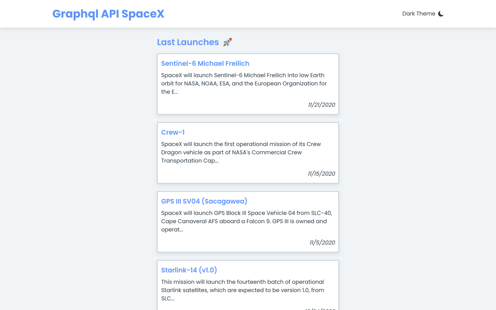
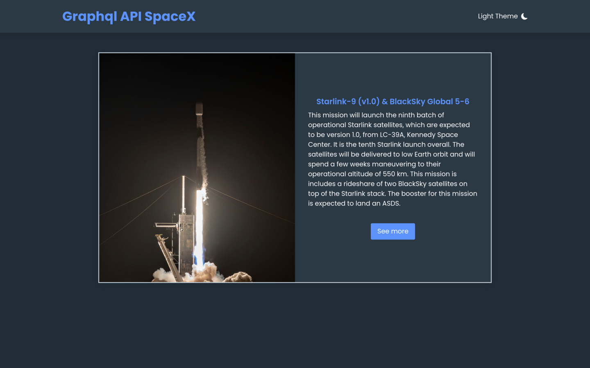
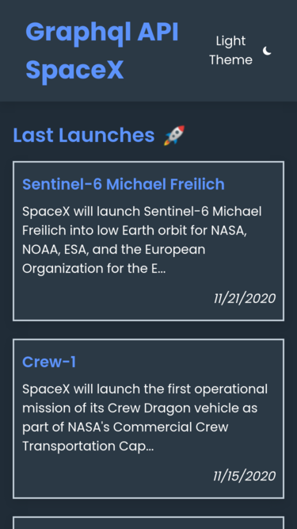
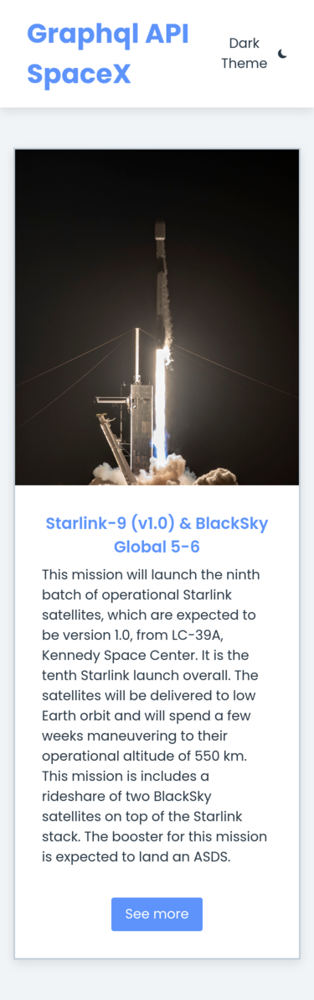

# 🚀 Front-End challenge - Graphql API SpaceX

## Sumário

- [Screenshots](#screenshots)
- [Instruções para setup](#instruções-para-setup)
- [Tecnologias](#tecnologias)
- [Possíveis melhorias](#possíveis-melhorias)

## Screenshots

## Instruções para setup
1. Clone o repositório:
  * `git clone git@github.com:adryanrosa/front-challenge-spacex.git`
  * Entre no diretório do repositório que você acabou de clonar:
    * `cd front-challenge-spacex.git`
  * Vá para a minha branch com:
    * `git checkout JR-adryanrosa && git pull`

2. Instale as dependências e inicialize o projeto
  * Instale as dependências:
    * `npm install`
  * Inicialize o projeto:
    * `npm start` (uma nova página deve abrir no seu navegador)

## Tecnologias
- [React](https://reactjs.org/) - Livraria JavaScript com uma comunidade gigantesca e amplamente usada no mercado
- [QraphQL Request](https://github.com/prisma-labs/graphql-request) - Considerada a mais madura, estável, e poderosa linguagem de extensão ao CSS do mundo
- [Sass](https://sass-lang.com/) - Simples e leve cliente GraphQL

## Possíveis melhorias
- Achar uma solução melhorar para exibir imagens de diferentes tamanhos e aspect-ratios nos detalhes da missão
- Enriquecer o layout
- Testar resultados da API, que parecem ser um tanto inconsistentes (algumas missões não possuem imagens, links, etc...) e garantir que todas as telas funcionem apesar disso