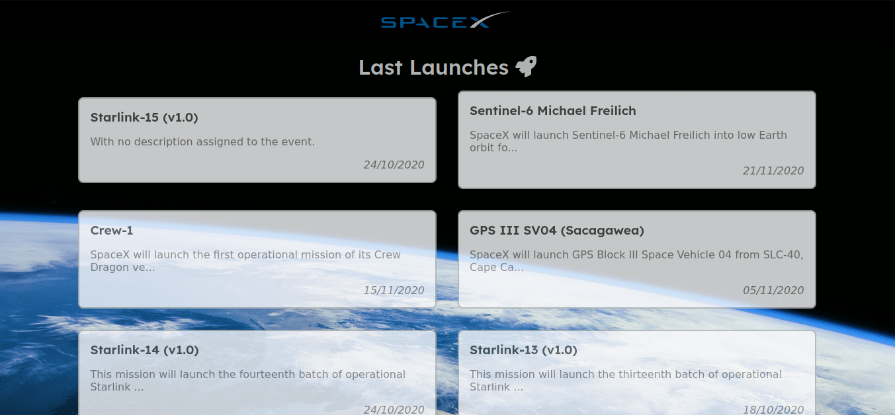
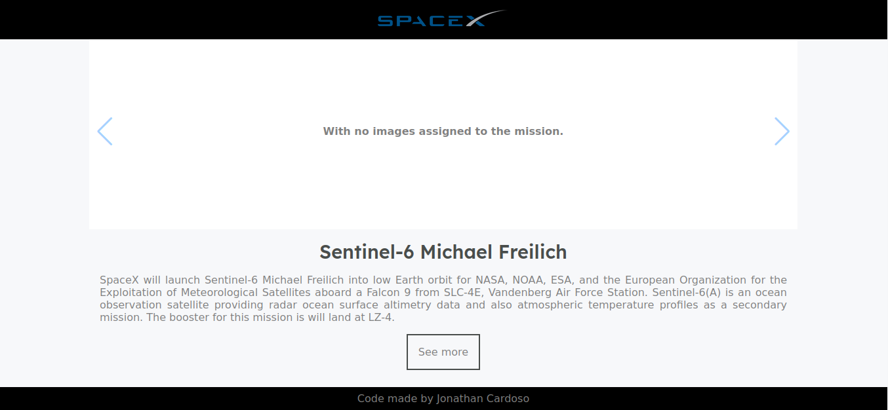

<h3 align="center">
  <br>
</h3>

## Prints

- Add prints of your application in the repository and use them in the readme.

<br>
<br>
<br>

## Getting started

Set VUE_APP_GRAPHQL_HTTP on `.env` with value `https://api.spacex.land/graphql/`

Install dependencies and running development

```bash
❯ yarn
❯ yarn serve
```

Creating build

```bash
❯ yarn build
```

## :zap: Technology

- VueJS
- Font Awesome
- Apollo Client
- Vue Router
- EsLint
- Date-fns
- Vue awesome swiper
- sass

## Questions

- Are there any improvements you could make to your submission:

Yes, it could improve in the styling and addition of SEO components.

- What would you do differently if you were allocated more time:

Improved layout and added more tests.
