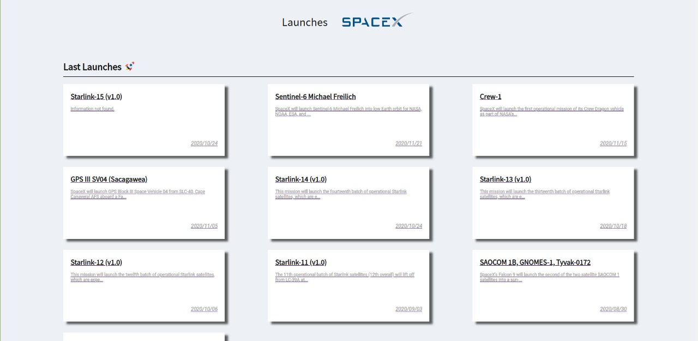
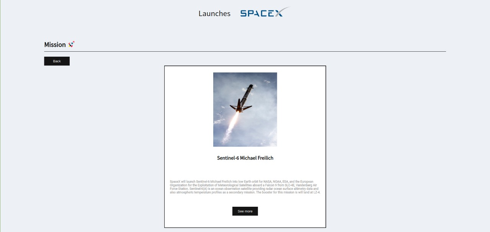

# Screens

## dashboard



## mission




## Routes

*Dashboard*
* List the last 10 missions
* Clicking on the card, goes to the Mission route

*Mission*
* Details of the mission (image, etc...)
* Button to external link


## 🚀 Getting Started

1. Download the repository

  - Using Git
```shell
  git clone https://github.com/gledson-ss/front-challenge-spacex.git
```

2. Switch branch

```shell
 git checkout JR-gledsonsantos
```

3. Installation
  - Using `yarn`
   ```shell
   yarn
   ```
  

4. Execution
  - Using `yarn`

  ```shell
   yarn serve
  ```
  

## 🧐 What's inside?

  - Vuejs
  - Typescript
  - Apollo-client
  - Graphql
  - Eslint