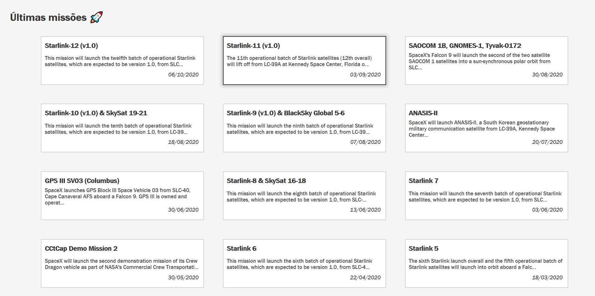
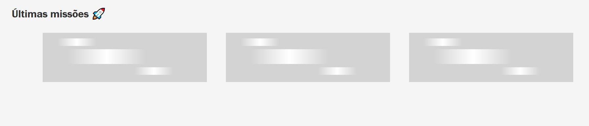
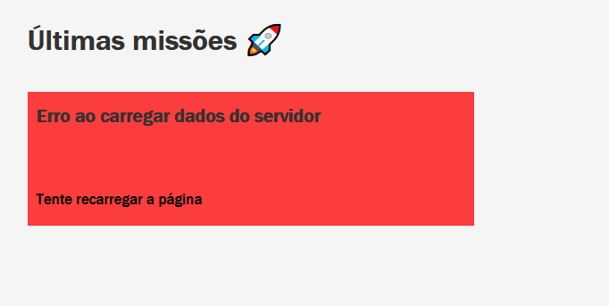
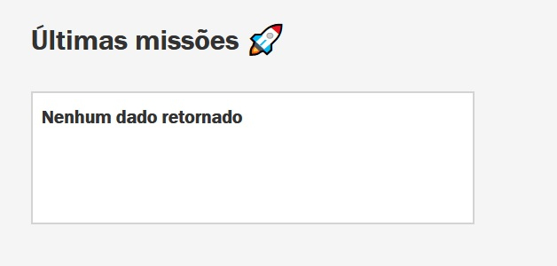
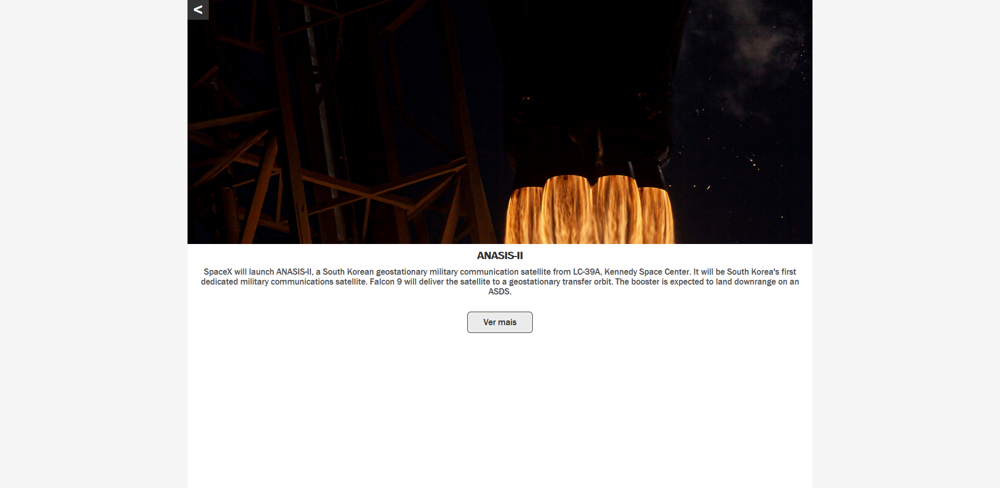
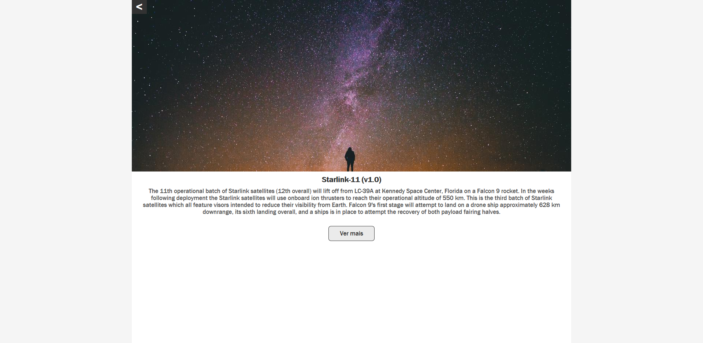

# Instruções e informações sobre o APP

Para saber como instalar e acessar olhe o [README](../README.md).

## Decisões

### Tecnologias

* Vue
	* Foi escolhido devido a minha familiaridade com a ferramenta, e por também possuir uma forte comunidade.
* Vue Apollo
	* Foi escolhido para conhecer novas ferramentas sobre GraphQL e ver se o sistema Apollo é mais simples do que as outras opções.

### Outros aspectos

* Cores
	* Apesar de estar simples o esquema de cores, eu tomei como inspiração as cores da SpaceX para definir o tema, que no caso seriam preto e branco.

## Possíveis melhorias

As possiveis melhorias seriam:
* Implementação de testes.
* Adicionar mais cores.
* Ajustar melhor o tamanho da tela na rota Mission.

## Possíveis adições caso eu tivesse mais tempo

Apesar do meu tempo dedicado não ter sido tão curto, eu passei boa parte dele aprendendo e configurando o Vue Apollo, e por isso, se eu me tivesse mais tempo para o projeto faria:

* Adicionar mais informações aos cards na tela de Dashboard.
* Adicionar mais informações na tela de Mission, como por exemplo, os navios associados a missão.

## Imagens do APP

### Tela ao entrar (Dashboard)

O card que está com bordar pretas representa quando o usuário está com o mouse em cima dele.

### Tela ao entrar (carregando os dados)

### Tela ao entrar (dados com erro)

### Tela ao entrar (a busca retornou em dados vazios)

### Tela ao usuário ter clicado em qual missão ele quer ver

### Tela ao usuário ter clicado em qual missão ele quer ver mas a missão não possui imagem

